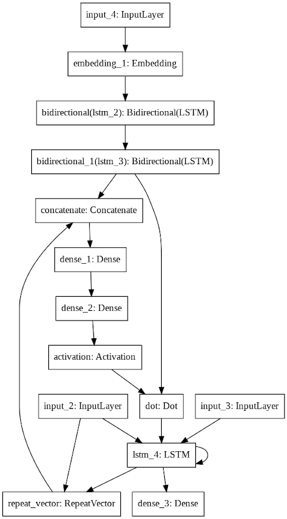

# Embeddings
> Training Word Embeddings and using them to perform Sentiment Analysis

## About
Word Embeddings are vector representations of words of a language, and are trained over large collection of raw text.
Here, we have trained word embeddings using the approach specified by the <b>Neural Probabalistic Language Model</b>. 
We use a large corpus of english text, drawn from a collection of novels from the 1880s, and use it to create a large number of context-target pair examples.
The Embeddings are <b>64</b> dimensional, and are built over a vocabulary of the <b>25000</b> most frequent words of the corpus.

The trained embeddings are evaluated by a set of simple <b>analogical reasoning</b> tasks, and then mapped to 2-D using the <b>t-SNE</b> algorithm for visualization.
Further, the trained embeddings are then used to perform Sentiment Analysis on the IMDB dataset of reviews. An attention based LSTM model, with a maximum input sequence length of <b>300</b> is used for the task of Sentiment Analysis. Its architecture is specified below

## Demo

Here is a 2D plot of the embeddings of some words. (The high dimensional embeddings are converted to 2-D using the t-SNE algorithm)

As you can see, words conveying emotions such <b>"sad"</b>, <b>"melancholy"</b>, <b>"happy"</b> and <b>"merry"</b> are grouped together.
Number words such as <b>"two"</b>, <b>"three"</b>, <b>"four"</b> and <b>"five"</b> are also grouped together.
Words with similar meanings such as <b>"under"</b> and <b>"beneath"</b>, and <b>"run"</b>, <b>"jump"</b> and <b>"leap"</b> are also grouped together.
Animal such as <b>"cat"</b>, <b>"dog"</b>, and <b>"horse"</b> are grouped together.
Words carrying temporal meanings such as <b>"month"</b>, <b>"year"</b> and <b>"hour"</b> are also grouped together.
Further, words such <b>"man"</b>, <b>"woman"</b>, <b>"king"</b> and <b>"queen"</b> are grouped together as well.

